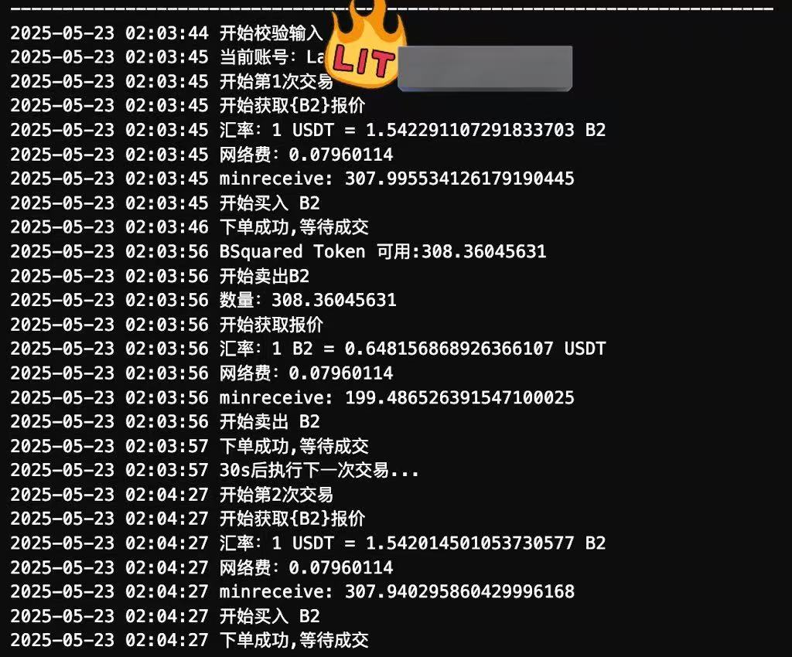

# 币安Alpha刷分web协议



运行环境： java1.8

下载： [https://github.com/WrBug/bnalpha/releases/tag/1.0](https://github.com/WrBug/bnalpha/releases/tag/1.0)

解压后，修改example.sh：

```shell

# http 代理 可选
export ENABLE_PROXY="0"
export PROXY_HOST="127.0.0.1"
export PROXY_PASSWORD=""
export PROXY_PORT="8888"
export PROXY_USERNAME=""


#交易数量 ：100USDT
export AMOUNT=1000
# bsc: 56, eth:1 ...
export CHAIN_ID=56

#bark key
export SEND_KEY=""


export UA_PLATFORM="Windows"
export UA="Mozilla/5.0 (Windows NT 10.0; Win64; x64) AppleWebKit/537.36 (KHTML, like Gecko) Chrome/127.0.0.0 Safari/537.36"

### 通过web抓包获取 ###
export DEVICE_INFO=""
export F_VIDEO_ID=""
export CSRF_TOKEN=""
export COOKIE=""
###                 ###


# 合约地址
export TOKEN_CA="0xc71b5f631354be6853efe9c3ab6b9590f8302e81"
# 币种名
export TOKEN_NAME="ZKJ"

#交易次数，默认1
export TRADE_COUNT=10
java -jar bnalpha-1.0-SNAPSHOT-all.jar
```
windows 可能需要手动配置环境变量，代码仅供参考，对于使用该软件造成的一些损失自行承担

## 欢迎关注我的推特： *quant_tr*
[](https://x.com/quant_tr)